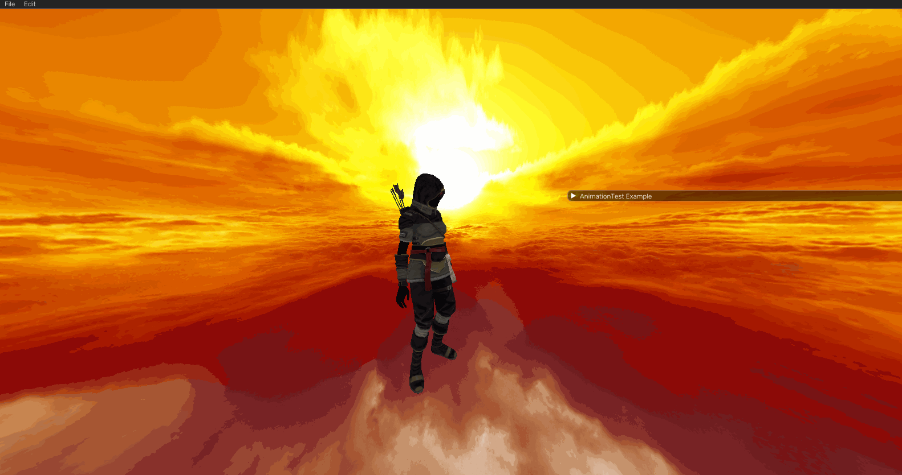

#   GEFA3D

3D Renderer, (one day) engine made using C++, YSE and OpenGL.

Using LearnOpenGL.com to build up this project in to a game engine with toolset specifically designed for procedural audio

# Current Progress

    Skeletal Animation
    Fake PBR
    Shadow mapping (point and directional light)
    Normal mapping

